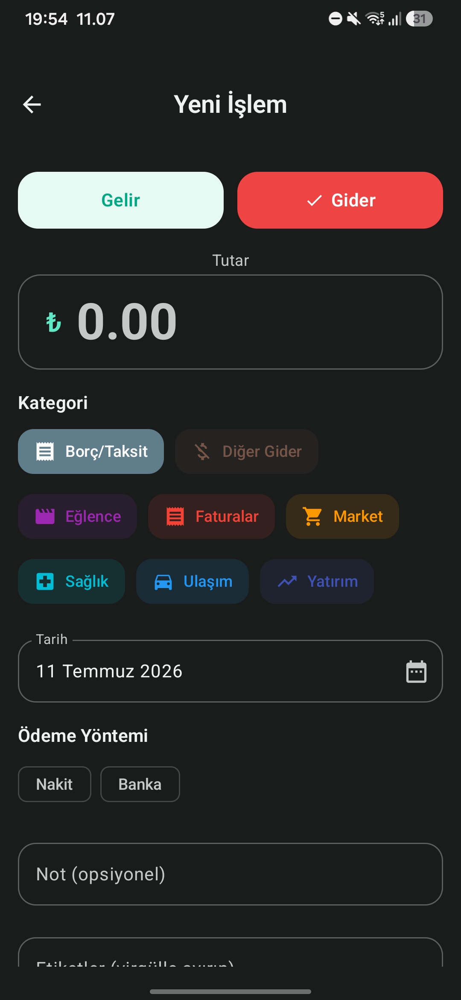
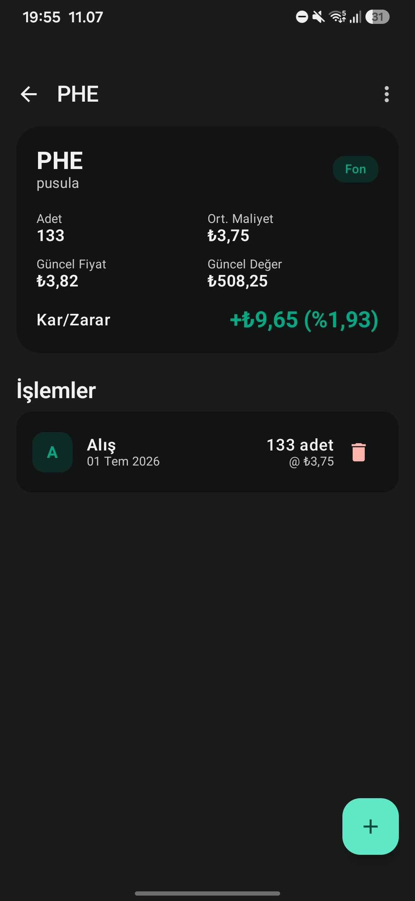
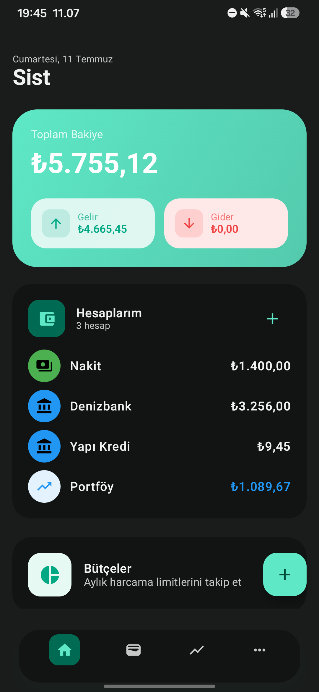
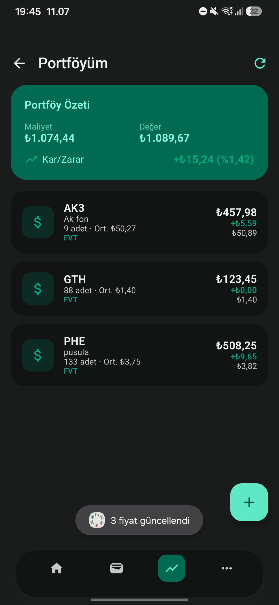

# 💰 Sist - Kişisel Finans ve Yatırım Takibi

> Gelir, gider, yatırım ve bütçenizi tek bir yerden, güvenle yönetin.

[](https://kotlinlang.org/)
[](https://developer.android.com/)
[](https://developer.android.com/jetpack/compose)
[](LICENSE)

**Sist**, Türk kullanıcılar için geliştirilmiş, modern ve kullanımı kolay bir kişisel finans ve yatırım takip uygulamasıdır. Çoklu hesap desteği, gerçek zamanlı fiyat güncellemeleri, ana ekran widget'ları ve otomatik hatırlatmalar ile finansal durumunuzu her an kontrol altında tutabilirsiniz.

# ⚠️ Yasal Uyarı

Bu uygulama yalnızca genel bilgilendirme ve kişisel takip amacıyla geliştirilmiştir. Uygulamada yer alan hisse senedi, kripto varlık, döviz, emtia, endeks ve diğer finansal verilere ilişkin bilgiler; yatırım tavsiyesi, yatırım danışmanlığı, alım-satım önerisi veya finansal tavsiye niteliği taşımaz.

Uygulamada sunulan fiyatlar, grafikler, teknik göstergeler, analizler, istatistikler, tahminler, yapay zekâ çıktıları, bildirimler ve diğer tüm içerikler yalnızca bilgi amaçlıdır. Bu içeriklerin doğruluğu, güncelliği, eksiksizliği veya belirli bir amaca uygunluğu garanti edilmez. Veri sağlayıcılarından kaynaklanabilecek gecikmeler, eksiklikler veya hatalar nedeniyle oluşabilecek sonuçlardan uygulama geliştiricisi sorumlu tutulamaz.

Yatırım kararları kişisel risk profili, finansal durum ve yatırım hedefleri dikkate alınarak verilmelidir. Gerektiğinde, Sermaye Piyasası Kurulu (SPK) tarafından yetkilendirilmiş yatırım kuruluşları veya yatırım danışmanlarından profesyonel destek alınması tavsiye edilir.

Bu uygulamanın kullanımı sonucunda doğabilecek doğrudan veya dolaylı maddi ya da manevi zararlar, kâr kaybı, veri kaybı veya diğer herhangi bir zarardan uygulama geliştiricisi hiçbir şekilde sorumlu değildir.

Bu uygulamayı kullanarak yukarıdaki şartları okuduğunuzu, anladığınızı ve kabul ettiğinizi beyan etmiş olursunuz.


---

## ✨ Özellikler

### 💳 Hesap ve İşlem Yönetimi
- Birden fazla banka/nakit hesabı tanımlama
- Gelir ve gider işlemleri kaydetme
- Kategorilere göre otomatik sınıflandırma
- Tekrarlayan işlemler (maaş, fatura, abonelik vb.)

### 📈 Portföy Takibi
- Hisse senedi, ETF ve yatırım fonu takibi
- **Yahoo Finance** entegrasyonu ile borsa verileri
- **FVT (Fintables)** entegrasyonu ile Türkiye yatırım fonları fiyatları
- Günlük kâr/zarar ve toplam portföy değeri
- Hisse/fon başına detaylı alım satım geçmişi

### 🎯 Bütçe Planlama
- Aylık kategori bazlı bütçe oluşturma
- Harcama limitlerine yaklaştıkça uyarılar
- Bütçe widget'ı ile anlık görünüm

### 💳 Borç ve Taksit Takibi
- Borçlar ve taksit planları oluşturma
- Yaklaşan ödeme hatırlatmaları

### 🔔 Bildirimler
- Günlük piyasa kapanış özeti (18:30)
- Bütçe aşım uyarıları
- Tekrarlayan işlem bildirimleri

### 🏠 Ana Ekran Widget'ları
- **Portföy Widget'ı** - Toplam değer, kâr/zarar ve varlık listesi
- **Bütçe Widget'ı** - Aylık bütçe durumu ve ilerleme çubuğu
- **Toplam Varlık Widget'ı** - Hesaplar + portföy toplamı
- **Hızlı Ekle Widget'ı** - Ana ekrandan hızlı gelir/gider ekleme

### 🔒 Güvenlik
- Biyometrik kimlik doğrulama (parmak izi / yüz tanıma)
- Yerel veri depolama (internet bağlantısı olmadan da çalışır)

---

## 📸 Ekran Görüntüleri

<p align="center">
  
  
  
  
</p>

---

## 🛠️ Teknolojiler

| Alan | Teknoloji |
|------|-----------|
| Dil | Kotlin 2.1.0 |
| UI | Jetpack Compose + Material 3 |
| Mimari | MVVM + Manual DI |
| Veritabanı | Room (KSP) |
| Ağ | Retrofit + OkHttp + Gson |
| Widget'lar | Glance App Widgets |
| Arkaplan İşlemleri | WorkManager |
| Grafikler | Vico |
| Min SDK | 26 (Android 8.0) |
| Target SDK | 36 (Android 16) |

---

## 📥 Kurulum

### Hazır APK ile Kurulum
En son sürümü [Releases](https://github.com/batuhd/sist/releases) sayfasından indirebilirsiniz.

1. `sist-v1.0.0.apk` dosyasını indirin.
2. Android cihazınıza aktarın.
3. APK dosyasına dokunarak yükleyin.
4. Gerekirse **Bilinmeyen kaynaklar** için izin verin.

### Kaynak Kodundan Derleme

```bash
# Repoyu klonlayın
git clone https://github.com/batuhd/sist.git
cd sist

# Debug APK derleyin
./gradlew assembleDebug

# Release APK derlemek için kendi imza bilgilerinizi build.gradle.kts'e ekleyin
./gradlew assembleRelease
```

---

## 🏗️ Mimari

```
app/
├── data/
│   ├── local/          # Room veritabanı, DAO'lar ve Entity'ler
│   ├── remote/         # API servisleri ve DTO'lar
│   ├── repository/     # Repository implementasyonları
│   └── mapper/         # Entity ↔ Domain model dönüşümleri
├── domain/
│   ├── model/          # Domain modelleri
│   ├── repository/     # Repository arayüzleri
│   └── usecase/        # Use case'ler
├── presentation/       # UI katmanı (Compose + ViewModel)
├── di/                 # Manuel Dependency Injection
└── worker/             # WorkManager arka plan görevleri
```

---

## ⚠️ Yasal Uyarı ve Sorumluluk Reddi

Bu uygulama yalnızca **kişisel finans takibi** amacıyla geliştirilmiştir. Uygulamada gösterilen hisse senedi, yatırım fonu, ETF veya diğer finansal veriler yalnızca bilgilendirme amaçlıdır.

- **Yatırım tavsiyesi değildir.**
- **Finansal danışmanlık hizmeti sunmaz.**
- **Yatırım kararlarınızın sorumluluğu tamamen size aittir.**

Sist ve geliştiricileri, uygulama üzerinden sunulan verilerin doğruluğu, eksiksizliği veya güncelliği konusunda herhangi bir garanti vermez. Gerçek para ile yapacağınız yatırım işlemlerinden önce yetkili bir finansal danışmana başvurmanız önemle tavsiye edilir.

---

## 🗺️ Yol Haritası

- [x] Gelir/gider takibi
- [x] Çoklu hesap desteği
- [x] Portföy yönetimi
- [x] Bütçe planlama
- [x] Borç/taksit takibi
- [x] Ana ekran widget'ları
- [x] Bildirimler
- [ ] CSV/Excel dışa aktarma
- [ ] Bulut yedekleme ve geri yükleme
- [ ] Koyu/aydınlık tema seçeneği
- [ ] Daha fazla widget boyutu

---

## 📄 Lisans

Bu proje [MIT Lisansı](LICENSE) ile lisanslanmıştır.

---

<div align="center">
  <sub>Built with ❤️ in Turkey</sub>
</div>
