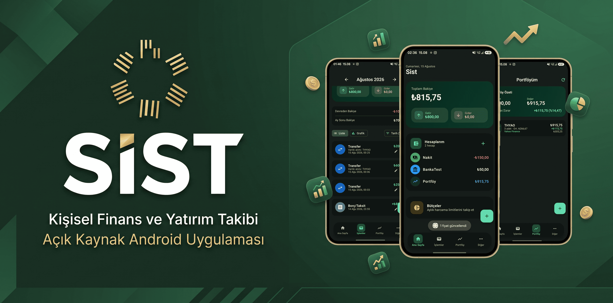

<div align="center">

# 🌿 SIST
### *Akıllı, Güvenli ve Özgür Kişisel Finans & Portföy Takip Ekosistemi*

**Tüm gelirlerinizi, giderlerinizi, banka ve yatırım hesaplarınızı, bütçelerinizi, borç ve taksitlerinizi tek bir çatı altında yönetin. Sıfır sunucu, %100 yerel gizlilik.**

<br>



<br><br>

[](https://kotlinlang.org/)
[](https://developer.android.com/)
[](https://developer.android.com/jetpack/compose)
[](https://developer.android.com/topic/architecture)
[](LICENSE)
[](https://github.com/batuhd/sist/releases/latest)

</div>

---

> ⚠️ **Önemli Yasal Bilgilendirme:** Sist, yatırım tavsiyesi, portföy danışmanlığı veya finansal yönlendirme vermez. Uygulama içerisindeki veriler (BIST hisseleri, fonlar, döviz kurları, piyasa hesaplamaları) sadece kişisel analiz ve takip amaçlıdır.

---

## 📌 İçindekiler
- [Uygulama Vizyonu](#-uygulama-vizyonu)
- [Uygulama Ekran Görüntüleri](#-ekran-g%C3%B6r%C3%BCnt%C3%BCleri)
- [Temel Özellikler & Fonksiyonel Modüller](#-temel-%C3%B6zellikler--mod%C3%BCller)
  - [1. Hesap ve Cüzdan Yönetimi](#1-hesap-ve-c%C3%BCzdan-y%C3%B6netimi)
  - [2. Gelir & Gider (Kasa) Takibi](#2-gelir--gider-kasa-takibi)
  - [3. Bütçe ve Harcama Disiplini](#3-b%C3%BCt%C3%A7e-ve-harcama-disiplini)
  - [4. Borç & Taksit Takip Sistemi](#4-bor%C3%A7--taksit-takip-sistemi)
  - [5. Yatırım & Portföy Yönetimi (BIST, TEFAS, ETF)](#5-yat%C3%B1r%C3%B1m--portf%C3%B6y-y%C3%B6netimi-bist-tefas-etf)
  - [6. Tekrarlayan & Otomatik İşlemler](#6-tekrarlayan--otomatik-%C4%B0%C5%9Flemler)
  - [7. Android Glance Ana Ekran Widget Ekosistemi](#7-android-glance-ana-ekran-widget-ekosistemi)
- [Sist Tasarım Sistemi (Design Tokens)](#-sist-tasar%C3%BDm-sistemi-design-tokens)
- [Gizlilik, Güvenlik ve Veri Politikası](#-gizlilik-g%C3%BCvenlik-ve-veri-politikas%C3%BD)
- [Piyasa Veri Kaynakları & Entegrasyonlar](#-piyasa-veri-kaynaklar%C3%BD--entegrasyonlar)
- [Teknoloji Yığını & Mimari Yapı](#-teknoloji-y%C3%BD%C4%9F%C3%BDn%C3%BD--mimari-yap%C3%BD)
- [Klasör ve Paket Mimarisi](#-klas%C3%B6r-ve-paket-mimarisi)
- [Geliştirici Kurulumu & Kaynak Koddan Derleme](#-geli%C5%9Ftirici-kurulumu--kaynak-koddan-derleme)
- [Arka Plan Görevleri (WorkManager & Boot)](#-arka-plan-g%C3%B6revleri-workmanager--boot)
- [Sıkça Sorulan Sorular (SSS)](#-s%C3%BDk%C3%A7a-sorulan-sorular-sss)
- [Gelecek Yol Haritası (Roadmap)](#-gelecek-yol-haritas%C3%BD-roadmap)
- [Lisans](#-lisans)

---

## 🌟 Uygulama Vizyonu

Günümüz finans uygulamalarının çoğu verilerinizi üçüncü parti sunucularda toplar, abonelik modelleri dayatır ya da hisse senedi/fon takibi ile günlük gelir-gider takibini birbirinden ayırır.

**Sist**, tam olarak bu kopukluğu gidermek üzere tasarlandı:
1. **Bütünleşik Yaklaşım:** Maaşınızdan market fişinize, Borsa İstanbul hisselerinizden TEFAS fonlarınıza, kredi kartı taksitlerinizden arkadaşınıza verdiğiniz borca kadar tüm finansal hayatınız tek ekranda.
2. **Kayıtsız Şartsız Gizlilik:** Hiçbir kullanıcı hesabı açmanız gerekmez. Bütün verileriniz **yalnızca telefonunuzun dahili hafızasındaki SQLite/Room veritabanında** yaşar.
3. **Kusursuz Tipografi ve Ergonomi:** Finansal rakamların hızlı okunmasını sağlayan tabular rakam (`tnum`) tipografisi, derin orman yeşili (`#00634D`) ve altın (`#7A5C0C`) vurgularıyla bezeli modern Material 3 arayüzü.

---

## 📱 Ekran Görüntüleri

<div align="center">
  <table style="border: none; border-collapse: collapse;">
    <tr>
      <td align="center" width="25%">
        
        <br><sub><b>Ana Sayfa & Net Varlık</b></sub>
      </td>
      <td align="center" width="25%">
        
        <br><sub><b>İşlemler & Filtreleme</b></sub>
      </td>
      <td align="center" width="25%">
        
        <br><sub><b>Canlı Portföy & Kâr/Zarar</b></sub>
      </td>
      <td align="center" width="25%">
        
        <br><sub><b>Bütçe & Taksit Takibi</b></sub>
      </td>
    </tr>
  </table>
</div>

---

## 🚀 Temel Özellikler & Modüller

### 1. Hesap ve Cüzdan Yönetimi
* **Çoklu Hesap Desteği:** Nakit Cüzdan, Vadesiz Banka Hesabı, Kredi Kartı, Yatırım Hesabı ve Özel Birikim hesapları tanımlayabilme.
* **Hesaplar Arası Virman/Transfer:** Komisyonsuz veya masraflı para transferleri oluşturarak hesap bakiyelerini eşzamanlı güncelleme.
* **Varsayılan Hesaplar:** Hızlı ekleme ekranlarında otomatik seçilecek ana hesapları belirleme.

### 2. Gelir & Gider (Kasa) Takibi
* **Zengin İşlem Detayları:** Miktar, işlem tarihi/saati, işlem tipi (Gelir, Gider, Transfer), kategori, ödeme yöntemi (Nakit, Kredi Kartı, Havale/EFT) ve özel etiket/notlar.
* **Aylık Kırılımlar & Filtreleme:** Aylara göre listeleme, kategori bazlı harcama dağılımı pasta grafikleri ve gelişmiş sıralama (Tarih, Tutar vb.).
* **Hızlı Düzenleme/Silme:** Tek dokunuşla geçmiş işlemleri güncelleme veya geri alma.

### 3. Bütçe ve Harcama Disiplini
* **Esnek Bütçeleme:** Aylık genel tavan harcama limiti veya kategori bazlı (Market, Ulaşım, Eğlence vb.) bütçe hedefleri belirleme.
* **Canlı İlerleme Çubuğu:** Yapılan harcamaların bütçeye oranını anlık takip etme, kritik eşiklerde görsel uyarı renkleri.
* **Aşım Projeksiyonu & Bildirimler:** Ay sonu tahmini harcama limit aşımı uyarısı ve periyodik arka plan bütçe denetimleri.

### 4. Borç & Taksit Takip Sistemi
* **Alacak ve Borç Defteri:** Kime ne kadar borç verildiği veya kimden ne kadar borç alındığının detaylı kaydı.
* **Kredi Kartı / Alışveriş Taksitleri:** Toplam tutar, taksit sayısı, kalan taksitler, aylık ödeme vadesi ve ödeme durumu takibi.
* **Yaklaşan Ödeme Bildirimleri:** Vadesi yaklaşan taksit ve borçlar için hatırlatıcılar.

### 5. Yatırım & Portföy Yönetimi (BIST, TEFAS, ETF)
* **Desteklenen Varlık Sınıfları:** 
  * 🇹🇷 **Borsa İstanbul (BIST)** Pay Senetleri
  * 🌐 **Global Hisseler & ETF'ler** (ABD Borsaları vb.)
  * 📈 **Türkiye Yatırım Fonları (TEFAS / FVT)**
  * 🪙 **Döviz & Kıymetli Madenler** (Gram Altın, Dolar, Euro vb.)
* **İşlem Geçmişi & Maliyet Hesabı:** Kademeli Alım/Satım emirleri, komisyon ücreti dahil ortalama maliyet (`averageCost`) hesaplaması.
* **Canlı Kâr / Zarar & Portföy Dağılımı:** Günlük ve kümülatif kâr/zarar tutarı, yüzdesel getiri, varlık türüne göre portföy ağırlık analizi.
* **Fiyat Alarmları:** Belirlediğiniz hedef fiyat eşiklerine ulaşıldığında anlık bildirim alma.

### 6. Tekrarlayan & Otomatik İşlemler
* **Düzenli Gelir/Giderler:** Maaş, kira, fatura, abonelikler (Netflix, Spotify vb.) ve aidatların sisteme tanıtılması.
* **Esnek Periyotlar:** Günlük, haftalık, aylık veya yıllık tekrar periyotları.
* **Arka Planda Otomatik İşleme:** Vade günü geldiğinde WorkManager arka plan servisi ile işlemin otomatik olarak cüzdana işlenmesi ve kullanıcıya bildirilmesi.

### 7. Android Glance Ana Ekran Widget Ekosistemi
Android'in modern **Glance (Jetpack Compose tabanlı AppWidget)** kütüphanesi ile geliştirilmiş, 6 farklı boyutlandırılabilir widget:

| Widget Türü | Fonksiyonu ve İçeriği |
| :--- | :--- |
| **📈 Portföy Widget'ı** | Toplam portföy değeri, günlük kâr/zarar durumu ve portföydeki en hareketli varlıklar. |
| **🎯 Bütçe Widget'ı** | Aylık bütçe doluluk oranı, kalan bütçe ve kategori bazlı harcama durumu. |
| **💎 Net Varlık Widget'ı** | Tüm nakit, banka ve yatırım varlıklarının toplam konsolide net değeri. |
| **⚡ Hızlı İşlem Widget'ı** | Uygulamayı açmadan ana ekrandan anında Gelir/Gider girişi yapmayı sağlayan mini konsol. |
| **📊 Portföy Dağılımı** | Hisse, Fon ve Nakit dağılımını gösteren özet görünüm. |
| **👀 Takip Listesi (Watchlist)** | Favori hisse ve fonlarınızın güncel fiyatlarını gösteren canlı borsa şeridi. |

> 🎨 **Widget Özelleştirme:** Her widget için **Marka Yeşili**, **Koyu Tema**, **Açık Tema** veya **Sistem Teması** seçilebilir; yazı boyutları ayarlanabilir.

---

## 🎨 Sist Tasarım Sistemi (Design Tokens)

Sist, finansal verilerin okunabilirliğini ve görsel şıklığı en üst düzeye çıkarmak için **Sist Design Tokens** standardını kullanır:

* **İmza Renk Paleti:** 
  * Primary: Derin Orman Yeşili (`#00634D` Light / `#5BDBAF` Dark)
  * Tertiary (İmza Vurgu): Altın (`#7A5C0C` Light / `#EBC15F` Dark)
  * Hero Panel: Her iki temada da derin yeşil-siyah yüzey (`#06281C`)
* **Finansal Semantik Renkler:**
  * Kâr / Gelir (`Positive`): `#0E7A55` / `#4EDC9D`
  * Zarar / Gider (`Negative`): `#C43B3B` / `#FF7B7B`
  * Uyarı (`Warning`): `#B45309` / `#FBBF24`
* **Tabular Tipografi (`tnum`):** Tutarların alt alta sıralandığında rakam genişliklerinin kaymaması için özel `FontFeatureSettings = "tnum"` kullanımı (`SistTypography`).
* **Ölçü ve Biçim Standartları:** `SistDimens` (4dp - 40dp) ve `SistRadius` (8dp - 28dp pill) ile tutarlı arayüz geometrisi.

---

## 🔒 Gizlilik, Güvenlik ve Veri Politikası

* **%100 Yerel Veritabanı:** Bilgileriniz harici bir sunucuya veya bulut hesabına aktarılmaz.
* **Devre Dışı Bırakılmış Cloud Backup:** Hassas finansal verilerin Google Drive veya Android Auto Backup ortamlarına istem dışı yüklenmesini engellemek için `android:allowBackup="false"` olarak kilitlenmiştir.
* **Biyometrik Güvenlik:** `androidx.biometric` entegrasyonu sayesinde uygulamayı açarken Parmak İzi veya Yüz Tanıma (BiometricPrompt) kilidi.
* **Ağ Güvenliği & Sıfır Log:** HTTP loglama (`HttpLoggingInterceptor`) yalnızca `DEBUG` derlemelerinde aktiftir. `RELEASE` modunda hiçbir ağ yanıtı veya hassas veri loglara yazılmaz.

---

## 📡 Piyasa Veri Kaynakları & Entegrasyonlar

Sist, anlık ve günlük piyasa verilerini aşağıdaki açık ve güvenilir kaynaklardan çeker:

| Varlık Kategorisi | Entegrasyon Kaynağı | Protokol & Yöntem |
| :--- | :--- | :--- |
| **Hisse Senetleri & Global ETF'ler** | Yahoo Finance API | Retrofit HTTP REST (JSON) |
| **Türkiye Yatırım Fonları (TEFAS)** | FVT (Fintables) | Retrofit HTTP REST / Data Parsing |
| **Döviz & Emtia Kurları** | Finans Web Servisleri | Asenkron Veri Sağlayıcı |

> *Not: Veri çekme isteklerinde yalnızca varlığın sembolü (örn. `THYAO.IS`, `AAPL`, `TI2`) gönderilir; kullanıcının sahip olduğu miktar veya maliyet gibi kişisel veriler asla iletilmez.*

---

## 🛠️ Teknoloji Yığını & Mimari Yapı

Sist, modern Android mühendisliğinin en güncel standartlarına göre inşa edilmiştir:

```text
┌─────────────────────────────────────────────────────────────┐
│                 Compose UI Katmanı (Screens)                │
│       HomeScreen • AssetsScreen • TransactionsScreen        │
└──────────────────────────────┬──────────────────────────────┘
                               │ StateFlow / UI Events
┌──────────────────────────────▼──────────────────────────────┐
│                    ViewModel Katmanı                        │
│         HomeViewModel • AssetsViewModel • etc.              │
└──────────────────────────────┬──────────────────────────────┘
                               │ Use Cases & Coroutines
┌──────────────────────────────▼──────────────────────────────┐
│                     Domain Katmanı                          │
│     Models • Repository Interfaces • Business Logic         │
└──────────────────────────────┬──────────────────────────────┘
                               │ Repository Implementation
┌──────────────────────────────▼──────────────────────────────┐
│                      Data Katmanı                           │
│  Room DB (SQLite/KSP) • Retrofit • Glance • DataStore       │
└─────────────────────────────────────────────────────────────┘
```

* **Programlama Dili:** Kotlin 2.1.0 (JVM 17)
* **Kullanıcı Arayüzü:** Jetpack Compose & Material 3
* **Mimari:** MVVM + Clean Architecture Prensipleri
* **Dependency Injection:** Manuel DI Container (`AppContainer`) — *Hızlı derleme, sıfır annotation-processing yükü ve AGP 9 uyumluluğu için Hilt yerine tercih edilmiştir.*
* **Veritabanı:** Room Database 2.7+ (KSP ile derlenen DAO'lar ve Entity'ler)
* **Arka Plan Yönetimi:** AndroidX WorkManager (Periyodik ve Kısıtlı Görevler)
* **Widget Teknolojisi:** AndroidX Glance AppWidget 1.1+
* **Grafik Çizimi:** Vico Compose Charting Engine
* **Ağ Katmanı:** OkHttp3 & Retrofit 2 (GSON / Kotlin Serialization)
* **Depolama / Tercihler:** Jetpack DataStore Preferences

---

## 📂 Klasör ve Paket Mimarisi

```text
app/src/main/java/com/sinop/sist/
│
├── data/
│   ├── local/               # Room Veritabanı, DAO'lar, Entity tanımları
│   │   ├── dao/             # AccountDao, AssetDao, TransactionDao, BudgetDao...
│   │   ├── database/        # SistDatabase sınıfı
│   │   └── entity/          # Room Entity modelleri
│   ├── mapper/              # Entity <-> Domain Model dönüştürücüleri
│   ├── remote/              # Retrofit API servisleri, DTO'lar, FVT Provider
│   └── repository/          # Domain arayüzlerinin somut implementasyonları
│
├── domain/
│   ├── model/               # Saf Kotlin veri sınıfları (Asset, Transaction, Budget...)
│   ├── repository/          # Repository arayüz kontratları
│   └── usecase/             # RefreshAssetPricesUseCase vb. iş mantıkları
│
├── presentation/            # Ekranlar ve UI bileşenleri
│   ├── assets/              # Portföy ekranı, varlık ekleme/detay ve alım-satım
│   ├── budget/              # Bütçe yönetimi ve harcama limitleri
│   ├── categories/          # Kategori yönetimi ekranı
│   ├── components/          # Ortak TopBar, Kartlar, Boş Durum (EmptyState) bileşenleri
│   ├── debts/               # Borç ve Taksit takip ekranı
│   ├── home/                # Ana sayfa dashboard ve özet görünüm
│   ├── navigation/          # Compose Navigation (NavHost, BottomBar, Routes)
│   ├── recurring/           # Tekrarlayan işlemler yönetim ekranı
│   ├── settings/            # Ayarlar, tema, bildirim ve log izleyici ekranları
│   ├── transactions/        # Gelir/Gider listesi ve işlem ekleme ekranı
│   └── widget/              # Glance AppWidget altyapısı, alıcıları ve temaları
│
├── ui/theme/                # SistColors, SistTypography, SistDimens, Theme
├── util/                    # Para birimi formatlayıcıları, uzantılar, CrashLogger
└── worker/                  # WorkManager arka plan işçileri (Fiyat, Bütçe, Alarm, Kapanış)
```

---

## ⚙️ Geliştirici Kurulumu & Kaynak Koddan Derleme

### Ön Koşullar
* **Android Studio:** Ladybug / Meerkat veya üzeri güncel sürüm
* **JDK:** Java 17
* **Android SDK:** Compile SDK 36 (minor API level 1), Min SDK 26

### 1. Depoyu Klonlayın
```bash
git clone https://github.com/batuhd/sist.git
cd sist
```

### 2. Debug Sürümünü Derleyin
```bash
# macOS / Linux
./gradlew assembleDebug

# Windows PowerShell
.\gradlew assembleDebug
```
*Oluşan APK:* `app/build/outputs/apk/debug/app-debug.apk`

### 3. İmzalı Release Sürümünü Derleme
Proje kök dizininde bir `keystore.properties` dosyası oluşturun:
```properties
storeFile=release-key.jks
storePassword=KEYSTORE_PAROLANIZ
keyAlias=sist-release
keyPassword=KEY_PAROLANIZ
```
Ardından derleme komutunu çalıştırın:
```bash
./gradlew assembleRelease
```
*Oluşan APK:* `app/build/outputs/apk/release/app-release.apk`

---

## ⏰ Arka Plan Görevleri (WorkManager & Boot)

Sist, kullanıcı uygulamayı açmasa bile finansal süreçleri aksatmamak için WorkManager ile entegre çalışır:

* **`PriceRefreshWorker`:** Portföydeki varlıkların piyasa fiyatlarını periyodik olarak günceller.
* **`PriceAlertWorker`:** Kullanıcının kurduğu hedef fiyat alarmlarını kontrol eder ve eşik aşıldığında bildirim fırlatır.
* **`BudgetCheckWorker`:** Aylık harcama limitlerini denetler; aşım tehlikesi olduğunda uyarı gönderir.
* **`RecurringTransactionWorker`:** Vadesi gelen tekrarlayan gelir/gider kayıtlarını otomatik olarak işler.
* **`MarketCloseNotificationWorker`:** Gün sonunda piyasa kapanış özetini ve günlük portföy performansını bildirir.
* **`BootReceiver`:** Cihaz yeniden başlatıldığında (`BOOT_COMPLETED`) tüm zamanlanmış görevleri sisteme tekrar kaydeder.

---

## ❓ Sıkça Sorulan Sorular (SSS)

<details>
<summary><b>1. Uygulama internet bağlantısı olmadan çalışır mı?</b></summary>
Evet. Sist'in temel çekirdeği (gelir/gider kaydı, cüzdan takibi, bütçeleme, borç/taksit hesapları) tamamen çevrimdışı (offline) çalışır. İnternet bağlantısı sadece piyasa fiyatlarını güncellemek ve fiyat alarmlarını tetiklemek için gereklidir.
</details>

<details>
<summary><b>2. Verilerim Google hesabıma veya sunuculara yedeklenir mi?</b></summary>
Hayır. Gizlilik prensipleri gereği Android Otomatik Yedekleme (`allowBackup`) kapalıdır. Uygulamayı kaldırdığınızda veriler cihazdan silinir. (Yakın zamanda manuel CSV/JSON dışa aktarma özelliği sunulacaktır.)
</details>

<details>
<summary><b>3. Neden Hilt veya Dagger kullanılmadı?</b></summary>
Sist, Android Gradle Plugin 9.x ve modern KSP optimizasyonları ile tam uyum sağlamak, derleme sürelerini milisaniyeler seviyesinde tutmak ve gereksiz kod üretiminin önüne geçmek için <code>AppContainer</code> tabanlı Manuel Dependency Injection kullanmaktadır.
</details>

<details>
<summary><b>4. Widget renkleri ana uygulamadaki temadan bağımsız değiştirilebilir mi?</b></summary>
Evet. Her widget'ın üst kısmındaki ayar simgesine dokunarak o widget'a özel renk paleti (Marka Yeşili, Koyu, Açık veya Sistem) ve yazı boyutu tanımlayabilirsiniz.
</details>

---

## 🗺️ Gelecek Yol Haritası (Roadmap)

- [x] Çoklu Hesap ve Kasa Yönetimi
- [x] BIST, Fon ve Global Varlık Portföy Takibi
- [x] 6 Farklı Glance Ana Ekran Widget'ı
- [x] Koyu & Açık Tema + Özel Marka Renk Paleti
- [x] Biyometrik (Parmak İzi / Yüz Tanıma) Uygulama Kilidi
- [x] Piyasa Kapanış Bildirimleri ve Fiyat Alarmları
- [ ] ⏳ **CSV & Excel Formatında İçe/Dışa Aktarma (Export/Import)**
- [ ] ⏳ **Grafiksel Kategori Raporları ve PDF Finansal Özet Çıktısı**
- [ ] ⏳ **Özelleştirilebilir Kategori Simgeleri & Renk Seçici**

---

## 📄 Lisans

Bu proje **[MIT Lisansı](LICENSE)** altında lisanslanmıştır. Özgürce inceleyebilir, geliştirebilir ve katkıda bulunabilirsiniz.

<div align="center">
  <br>
  <sub>Sist Finansal özgürlüğünüz için sinopta açık kaynaklı olarak geliştirildi.</sub>
</div>
