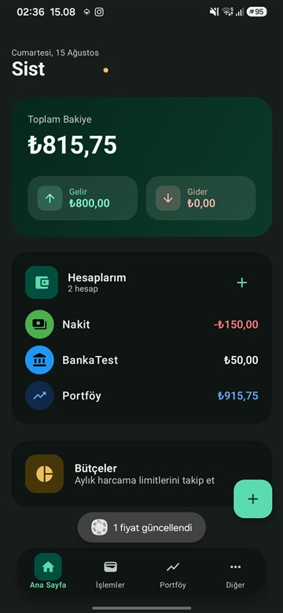
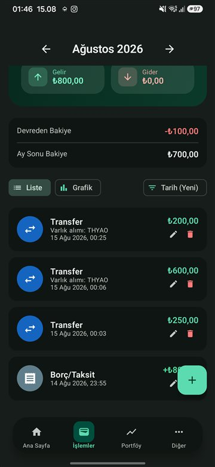
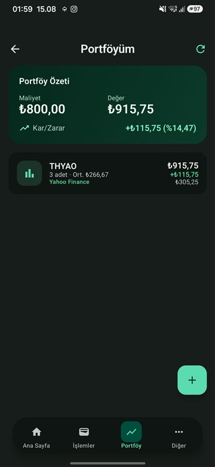
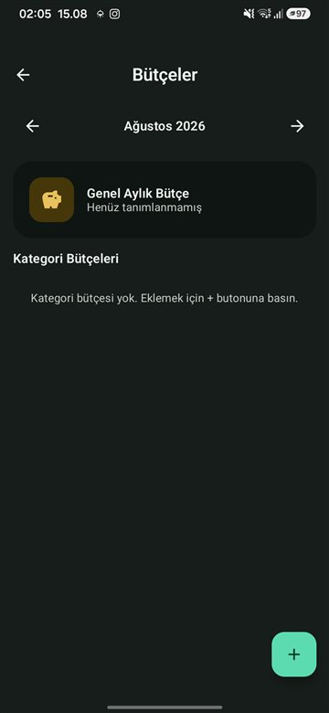

# Sist — Kişisel Finans ve Yatırım Takibi

> Gelir, gider, yatırım ve bütçeni tek bir yerden, internet bağlantısı olmadan yönet.

[](https://kotlinlang.org/)
[](https://developer.android.com/)
[](https://developer.android.com/jetpack/compose)
[](LICENSE)
[](https://github.com/batuhd/sist/releases/latest)

**Sist**, Türk kullanıcılar için geliştirilmiş, modern ve kullanımı kolay bir kişisel finans ve yatırım takip uygulamasıdır. Çoklu hesap desteği, gerçek zamanlı fiyat güncellemeleri, ana ekran widget'ları ve otomatik hatırlatmalar ile finansal durumunuzu her an kontrol altında tutabilirsiniz.

---

## Hemen İndir

En son sürümü [Releases](https://github.com/batuhd/sist/releases) sayfasından indirebilirsiniz.

| Sürüm | Açıklama |
|-------|----------|
| `sist-vX.Y.Z.apk` | İmzalı ve optimize edilmiş release sürümü (önerilen) |
| `sist-vX.Y.Z-debug.apk` | Hata ayıklama amaçlı debug sürümü |

> **Not:** v2.0.1 ve sonrası yeni bir imza anahtarı kullanmaktadır. v2.0.0 ve öncesi sürümlerden doğrudan güncelleme yapamazsınız; uygulamayı silip yeni sürümü kurmanız gerekir.

---

## Ekran Görüntüleri

<p align="center">
  
  
  
  
</p>

---

## Neden Sist?

- **Tamamen Yerel:** Tüm finansal verileriniz cihazınızda kalır. Cloud yedekleme kapalıdır (`android:allowBackup="false"`).
- **Açık Kaynak:** Kod tamamen görülebilir ve denetlenebilir.
- **Türkiye Odaklı:** Fintables (FVT) entegrasyonu ile Türkiye yatırım fonlarına özel destek.
- **Modern Arayüz:** Jetpack Compose ve Material 3 ile tutarlı, akıcı bir deneyim.
- **Çevrimdışı Çalışır:** İnternet bağlantısı olmadan işlem ekleyebilir, hesaplarınızı yönetebilirsiniz.

---

## Özellikler

### Hesap ve İşlem Yönetimi
- Birden fazla banka, nakit ve yatırım hesabı tanımlama
- Gelir ve gider işlemleri kaydetme
- Kategorilere göre otomatik sınıflandırma
- Tekrarlayan işlemler (maaş, fatura, abonelik vb.)

### Portföy Takibi
- Hisse senedi, ETF ve yatırım fonu takibi
- **Yahoo Finance** entegrasyonu ile borsa verileri
- **FVT (Fintables)** entegrasyonu ile Türkiye yatırım fonları fiyatları
- Günlük kar/zarar ve toplam portföy değeri
- Hisse/fon bazında detaylı alım-satım geçmişi

### Bütçe Planlama
- Aylık kategori bazlı bütçe oluşturma
- Harcama limitlerine yaklaştıkça uyarılar
- Bütçe widget'ı ile anlık görünüm

### Borç ve Taksit Takibi
- Borçlar ve taksit planları oluşturma
- Yaklaşan ödeme hatırlatmaları

### Bildirimler
- Günlük piyasa kapanış özeti (18:30)
- Bütçe aşım uyarıları
- Tekrarlayan işlem bildirimleri

### Ana Ekran Widget'ları
- **Portföy Widget'ı** — Toplam değer, kar/zarar ve varlık listesi
- **Bütçe Widget'ı** — Aylık bütçe durumu ve ilerleme çubuğu
- **Toplam Varlık Widget'ı** — Hesaplar + portföy toplamı
- **Hızlı Ekle Widget'ı** — Ana ekrandan hızlı gelir/gider ekleme

### Güvenlik
- Biyometrik kimlik doğrulama (parmak izi / yüz tanıma)
- Yerel veri depolama
- Release build'lerinde ağ loglaması kapalı

---

## Güvenlik ve Gizlilik

Sist, finansal verilerinizin gizliliğini önceliklendirir:

- **Yerel Depolama:** Tüm veriler Room veritabanı ile cihazınızda saklanır.
- **Cloud Yedekleme Yok:** `AndroidManifest.xml`'de `android:allowBackup="false"` olarak ayarlanmıştır. Uygulamayı silerseniz veriler tamamen silinir.
- **Biyometrik Kilit:** Uygulama girişinde parmak izi veya yüz tanıma desteği.
- **Güvenli İmza:** v2.0.1 itibarıyla yeni bir release imza anahtarı kullanılmaktadır.

---

## Teknolojiler

| Alan | Teknoloji |
|------|-----------|
| Dil | Kotlin 2.1.0 |
| UI | Jetpack Compose + Material 3 |
| Tasarım Sistemi | SistColors, SistTypography, SistDimens, SistMotion |
| Mimari | MVVM + Manuel Dependency Injection |
| Veritabanı | Room (KSP) |
| Ağ | Retrofit + OkHttp + Gson |
| Widget'lar | Glance App Widgets |
| Arkaplan İşlemleri | WorkManager |
| Grafikler | Vico |
| Min SDK | 26 (Android 8.0) |
| Target SDK | 36 (Android 16) |

---

## Kurulum

### Hazır APK ile Kurulum

1. [Releases](https://github.com/batuhd/sist/releases) sayfasından en son `sist-vX.Y.Z.apk` dosyasını indirin.
2. APK dosyasını Android cihazınıza aktarın.
3. APK dosyasına dokunarak yükleyin.
4. Gerekirse **Bilinmeyen kaynaklar** için izin verin.

### Kaynak Kodundan Derleme

```bash
# Repoyu klonlayın
git clone https://github.com/batuhd/sist.git
cd sist

# Debug APK derleyin
./gradlew assembleDebug

# Release APK derlemek için kendi imza bilgilerinizi yapılandırın
# keystore.properties dosyasını oluşturun ve ardından:
./gradlew assembleRelease
```

#### Kendi İmza Bilgilerinizle Derleme

Proje kökünde `keystore.properties` dosyası oluşturun:

```properties
storeFile=release-key.jks
storePassword=YOUR_STORE_PASSWORD
keyAlias=sist-release
keyPassword=YOUR_KEY_PASSWORD
```

Kendi keystore dosyanızı oluşturmak için:

```bash
keytool -genkey -v -keystore release-key.jks -alias sist-release -keyalg RSA -keysize 4096 -validity 10000
```

---

## Mimari

```
app/
├── data/
│   ├── local/          # Room veritabanı, DAO'lar ve Entity'ler
│   ├── remote/         # API servisleri ve DTO'lar
│   ├── repository/     # Repository implementasyonları
│   └── mapper/         # Entity ↔ Domain model dönüşümleri
├── domain/
│   ├── model/          # Domain modelleri
│   ├── repository/     # Repository arayüzleri
│   └── usecase/        # Use case'ler
├── presentation/       # UI katmanı (Compose + ViewModel)
├── di/                 # Manuel Dependency Injection
└── worker/             # WorkManager arka plan görevleri
```

---

## Sık Sorulan Sorular

**Uygulamayı sildiğimde verilerim ne olur?**

Tüm veriler cihazda saklandığı için ve cloud yedekleme kapalı olduğundan, uygulamayı sildiğinizde verileriniz tamamen silinir. Yedek almak isterseniz ileride eklenecek CSV/Excel dışa aktarma özelliğini bekleyebilirsiniz.

**Verilerim buluta gidiyor mu?**

Hayır. Sist'te cloud yedekleme yoktur. Fiyat güncellemeleri dışında hiçbir finansal veri internete gönderilmez.

**Yatırım verileri nereden geliyor?**

Hisse senedi ve ETF verileri Yahoo Finance'ten, Türkiye yatırım fonu verileri Fintables (FVT)'ten sağlanır. Bu veriler yalnızca bilgilendirme amaçlıdır.

**Eski sürümden yeni sürüme güncelleme yapabilir miyim?**

v2.0.1 ve sonrası yeni bir imza anahtarı kullanmaktadır. Bu nedenle v2.0.0 ve öncesi sürümlerden doğrudan güncelleme yapamazsınız. Uygulamayı silip yeni sürümü kurmanız gerekir.

---

## Tasarım Sistemi

Sist, v2.0.0 ile birlikte merkezi bir tasarım sistemi üzerine kuruludur:

- **Renk:** `SistColors` — kar/zarar, uyarı, altın vurgu ve kategori renkleri tek kaynaktan yönetilir.
- **Tipografi:** `SistTypography` — tutar ve para birimi gösterimlerinde tabular rakamlar kullanılır; listelerde hizalama kaymaz.
- **Boşluk ve Yarıçap:** `SistDimens` (4/8/12/16/24/32dp) ile tutarlı arayüz ölçüleri.
- **Hareket:** `SistMotion` ile tutarlı animasyon süreleri ve yumuşatma eğrileri.

Detaylı dokümantasyon: [`docs/design-tokens.md`](docs/design-tokens.md)

---

## Yasal Uyarı ve Sorumluluk Reddi

Bu uygulama yalnızca genel bilgilendirme ve kişisel takip amacıyla geliştirilmiştir. Uygulamada yer alan hisse senedi, kripto varlık, döviz, emtia, endeks ve diğer finansal verilere ilişkin bilgiler; yatırım tavsiyesi, yatırım danışmanlığı, alım-satım önerisi veya finansal tavsiye niteliği taşımaz.

Uygulamada sunulan fiyatlar, grafikler, analizler, istatistikler, bildirimler ve diğer tüm içerikler yalnızca bilgi amaçlıdır. Bu içeriklerin doğruluğu, güncelliği, eksiksizliği veya belirli bir amaca uygunluğu garanti edilmez. Veri sağlayıcılarından kaynaklanabilecek gecikmeler, eksiklikler veya hatalar nedeniyle oluşabilecek sonuçlardan uygulama geliştiricisi sorumlu tutulamaz.

Yatırım kararları kişisel risk profili, finansal durum ve yatırım hedefleri dikkate alınarak verilmelidir. Gerektiğinde, Sermaye Piyasası Kurulu (SPK) tarafından yetkilendirilmiş yatırım kuruluşları veya yatırım danışmanlarından profesyonel destek alınması tavsiye edilir.

Bu uygulamanın kullanımı sonucunda doğabilecek doğrudan veya dolaylı maddi ya da manevi zararlar, kar kaybı, veri kaybı veya diğer herhangi bir zarardan uygulama geliştiricisi hiçbir şekilde sorumlu değildir.

Bu uygulamayı kullanarak yukarıdaki şartları okuduğunuzu, anladığınızı ve kabul ettiğinizi beyan etmiş olursunuz.

---

## Yol Haritası

- [x] Gelir/gider takibi
- [x] Çoklu hesap desteği
- [x] Portföy yönetimi
- [x] Bütçe planlama
- [x] Borç/taksit takibi
- [x] Ana ekran widget'ları
- [x] Bildirimler
- [x] Koyu/aydınlık tema desteği
- [x] Biyometrik kimlik doğrulama
- [x] Cloud yedeklemeyi devre dışı bırakma
- [ ] CSV/Excel dışa aktarma
- [ ] Daha fazla widget boyutu
- [ ] Özelleştirilebilir kategoriler ve simgeler

---

## Lisans

Bu proje [MIT Lisansı](LICENSE) ile lisanslanmıştır.

---

<div align="center">
  <sub>Built with care in Turkey</sub>
</div>
